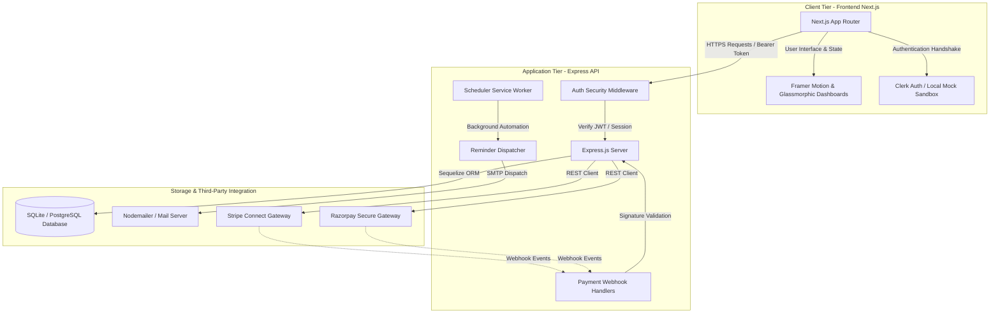
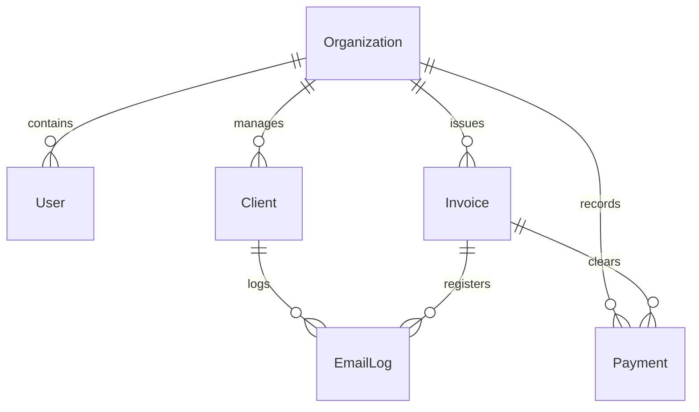
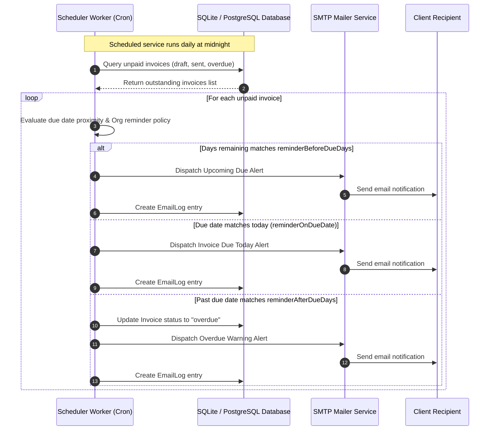
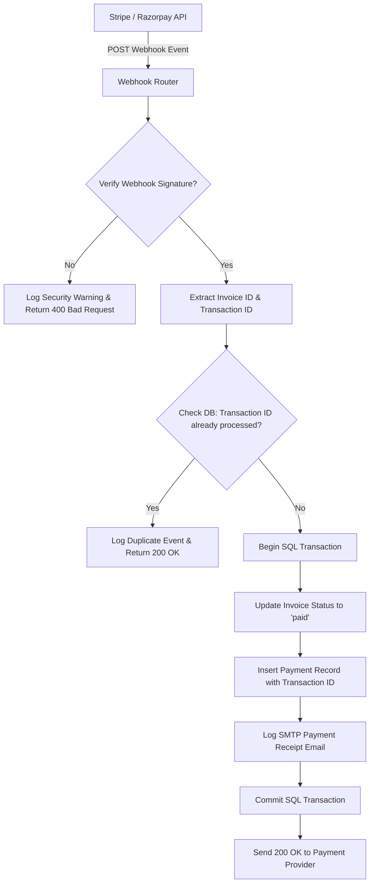

# Collectly 🚀 — Premium SaaS Billing & Automated Reminders

[](https://opensource.org/licenses/MIT)
[](https://nextjs.org/)
[](https://nodejs.org/)
[](https://sequelize.org/)

Collectly is a high-fidelity, premium SaaS billing, invoicing, and payment collection platform built for modern freelancers and agencies. It features sleek glassmorphic dashboards, robust dual-gateway checkouts, custom automated reminder policies, and unified client directory profiles.

## 📋 Table of Contents
1. [🎨 Premium Features & Architecture](#-premium-features--architecture)
2. [🏗️ System Design & Architecture](#-system-design--architecture)
3. [📂 Project Directory Structure](#-project-directory-structure)
4. [📡 REST API Endpoint Directory](#-rest-api-endpoint-directory)
5. [⚙️ Fast-Track Developer Setup](#-fast-track-developer-setup)
6. [🛡️ Premium UI Aesthetics](#-premium-ui-aesthetics)
7. [🤝 Contributing](#-contributing)
8. [📄 License](#-license)

## 🎨 Premium Features & Architecture

### 1. Interactive Freelancer Workspace
- **Glassmorphic KPI Cards**: Live outstanding dues, paid this month, upcoming balances, and overdue count.
- **Client Search & Directory**: Dynamic fuzzy search, responsive directory list, and floating onboarding modals.
- **Client Profiles**: Instant ledger aggregation tracking unpaid/paid invoices, visual SMTP communication timelines, and payment histories.
- **Cashflow Analytics**: Visual cash flow charts and real-time activity streams of notifications.

### 2. Dual-Reminders Synchronization Tunnel
- **Automated Policies**: Custom schedule parameters (`reminderBeforeDueDays`, `reminderOnDueDate`, `reminderAfterDueDays`) managed directly in settings. A background daily scheduler worker evaluates unpaid balances, translates states to overdue, and dispatches proximity email notifications.
- **Manual Reminders**: Direct inline checkouts instantly matching templates (upcoming, due-today, overdue) based on due date proximity, writing communication logs, and rendering visual duplicate indicators.
- **Payment Hooks Sync**: Automatically silences scheduled notifications the instant a checkout succeeds.

### 3. Multi-Gateway Payment Checkouts
- Unified checkout forms utilizing **Stripe Connect** and **Razorpay Secure**.
- Webhook signature validation (`constructEvent` & `validateWebhookSignature`) hardens endpoints against spoofing.
- Strict double-payment guards check transaction IDs before persisting ledgers, eliminating duplicate logs or credits.
- Dynamic offline mock checkout simulator for frictionless development.

### 4. Zero-Dependency Developer Offline Sandbox
- High-fidelity **Mock Authentication Sandbox** completely skips Clerk CDN scripts during outages.
- Local SQLite database pre-seeded with mockup parameters enables offline sandbox runs immediately.

## 🏗️ System Design & Architecture

### 1. High-Level Architecture Overview
Collectly is built on a decoupled **Client-Server Architecture** separating the Next.js frontend, an Express/Sequelize API gateway, and external authentication, payment, and mailing microservices.



### 2. Database Schema & ERD
The database schema uses Sequelize to map relationships between organizations, users, clients, invoices, payments, and communication logs:



### 3. Invoice Reminder Lifecycle & Logic Flow
The background automated **Reminder Service** tracks due dates and organization settings to automate outreach.



### 4. Webhook Ingestion & Double-Payment Guards
Security and transactional consistency are maintained through webhook validation and state guards.



## 📂 Project Directory Structure

```
Collectly/
├── collectly-app/        # Premium Next.js 16 (Turbopack) Frontend
│   ├── src/
│   │   ├── app/          # App Router (Dashboard, Invoices, Settings, Pay)
│   │   ├── context/      # Authentication & State wrappers
│   │   └── lib/          # API Clients & Utility configurations
└── backend/              # Robust Node.js Express Backend API
    ├── config/           # Database, Mailer, and Clerk integrations
    ├── controllers/      # Request handlers & Business logics
    ├── models/           # Sequelize Model Schema Definitions
    ├── routes/           # REST Route Directories
    └── services/         # Automated Scheduler & Mail Dispatches
```

## 📡 REST API Endpoint Directory

### 🔒 Authentication Guards
All endpoints are secured via JWT tokens decoded via Clerk keys or Offline Mock decryption.

| Method | Endpoint | Description |
| :--- | :--- | :--- |
| **GET** | `/api/v1/health` | Service status, database connectivity & server uptime. |
| **GET** | `/api/v1/dashboard/summary` | Live outstanding KPI counters, chart analytics & activity logs. |
| **GET** | `/api/v1/clients` | Retrieve all managed organization clients & total outstanding sums. |
| **POST** | `/api/v1/clients` | Onboard a new client & issue credentials. |
| **GET** | `/api/v1/clients/:id/profile` | Aggregate individual client profiles, unpaid invoice logs & SMTP histories. |
| **GET** | `/api/v1/invoices` | List and filter invoices by payment status, client, or date. |
| **POST** | `/api/v1/invoices` | Draft/Create a new client invoice. |
| **POST** | `/api/v1/invoices/:id/payments` | Manually record client transaction receipts. |
| **POST** | `/api/v1/invoices/:id/remind` | Trigger a manual client reminder email. |
| **GET** | `/api/v1/payments/credentials` | Retrieve Connection statuses & masked API keys. |
| **POST** | `/api/v1/payments/credentials` | Securely update Stripe/Razorpay keys and automated reminder rules. |

#### Example Invoice Creation Payload:
```json
{
  "clientName": "Acme Corp",
  "clientEmail": "billing@acme.com",
  "amount": 1500,
  "dueDate": "2026-06-15",
  "description": "Software Development Services"
}
```

## ⚙️ Fast-Track Developer Setup

### Prerequisites
- Node.js (v18+)
- npm (v9+)

### 1. Configure Environments
Create a `.env` in the `backend/` directory:
```env
PORT=5001
NODE_ENV=development
FRONTEND_URL=http://localhost:3000
CLERK_SECRET_KEY=sk_test_...
DATABASE_URL= # Omit to automatically default to Sandbox SQLite
```

Create a `.env.local` in `collectly-app/`:
```env
NEXT_PUBLIC_API_URL=http://localhost:5001/api/v1
NEXT_PUBLIC_CLERK_PUBLISHABLE_KEY=pk_test_...
NEXT_PUBLIC_MOCK_AUTH=true # Toggle to TRUE to skip external CDN dependency and login offline!
```

### 2. Start the Backend API
```bash
cd backend
npm install
npm run dev
```

### 3. Start the Next.js Frontend
```bash
cd collectly-app
npm install
npm run dev
```
Open [http://localhost:3000](http://localhost:3000) to view the SaaS Workspace!

### 4. Local Webhook Simulations
You can mock webhook payment capture notifications directly using `curl`:
```bash
# Stripe Webhook
curl -X POST http://localhost:5001/api/v1/payments/webhooks/stripe \
  -H "Content-Type: application/json" \
  -d '{"type": "checkout.session.completed", "data": {"object": {"id": "cs_test_123", "amount_total": 45000, "metadata": {"invoiceId": "<INVOICE_ID>"}}}}'
```

---

## 🛡️ Premium UI Aesthetics
- Vibrant Dark Mode layout with harmonious glassmorphism and subtle CSS gradients.
- Micro-interactions powered by `framer-motion` for buttery smooth transitions.
- Descriptive error panels, responsive form states, and premium visual communication timelines.

---

## 🤝 Contributing
Contributions are welcome! Please open an issue or submit a pull request with details of your proposed improvements.

## 📄 License
This project is licensed under the MIT License - see the LICENSE file for details.
